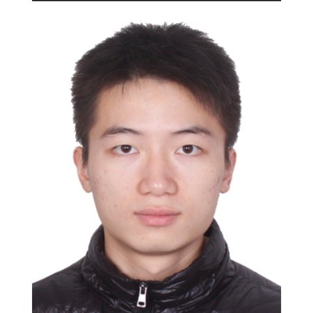

<head>
<script type="text/javascript" src="https://cdn.mathjax.org/mathjax/latest/MathJax.js?config=TeX-AMS-MML_HTMLorMML">
</script>
<script type="text/x-mathjax-config">
MathJax.Hub.Config({ tex2jax: {inlineMath: [['$','$'], ['\\(','\\)']], processEscapes: true}, "HTML-CSS": {minScaleAdjust: 100} });
</script>
</head>

**Abstract:**
Given point cloud input, the problem of 6-DoF grasp pose detection is to identify a set of hand poses in $\SE(3)$ from which an object can be successfully grasped. This important problem has many practical applications. Here we propose a novel method and neural network model that enables better grasp success rates relative to what is available in the literature. The method takes standard point cloud data as input and works well with single-view point clouds observed from arbitrary viewing directions.

<style>
.column {
  float: left;
  width: 33.33%;
}
.lc{
  float: left;
  width: 16.66%;
}
.caption {
    margin: 0;
    vertical-align: baseline;
    text-align: center;
}

.column_l {
  float: left;
  width: 50.00%;
}
.lc{
  float: left;
  width: 16.66%;
}
.caption {
    margin: 0;
    vertical-align: baseline;
    text-align: center;
}
.row::after {
  content: "";
  clear: both;
  display: table;
}


img.rounded {
  object-fit: cover;
  border-radius: 50%;
  height: 120px;
  width: 120px;
  margin-left: auto;
  margin-right: auto;
  display: block;
}
.people_column {
  float: left;
  width: 150px;
}
</style>

## Paper &nbsp;&nbsp; &nbsp;&nbsp; [PDF]()&nbsp;&nbsp;•&nbsp;&nbsp; [CODE]()&nbsp;&nbsp;•&nbsp;&nbsp;**Arxiv Preprint**

<div style="width:100%; display:flex">
  
<div class="people_column">
    
    <p class="caption">
      <a href="https://haojhuang.github.io">Haojie Huang</a>
    </p>
  </div>

  <div class="people_column">
    
    <p class="caption">
      <a href="https://pointw.github.io">Dian Wang</a>
    </p>
  </div>

  <div class="people_column">
    
    <p class="caption">
      <a href="https://pointw.github.io">Dian Wang</a>
    </p>
  </div>

  <div class="people_column">
    
    <p class="caption">
      <a href="http://mathserver.neu.edu/robin/">Robin Walters</a>
    </p>
  </div>

  <div class="people_column">
    
    <p class="caption">
      <a href="http://www.ccs.neu.edu/home/rplatt/">Robert Platt</a>
    </p>
  </div>

</div>

&nbsp;&nbsp; &nbsp;&nbsp; &nbsp;&nbsp;&nbsp;&nbsp; &nbsp;&nbsp; &nbsp;&nbsp; Khoury College of Computer Science, Northeastern University

## Elevator Pitch

### Sampling-based grasp detection network

### Highlight

In our paper, we will first define the edge grasp. Then, describe our representation of edge grasp step by step. After that we explore the $\mathrm(SE)(3)$ symmetry inside our representation.

The simulated experiment part of our paper is based on the simulator of  [VGN](https://github.com/ethz-asl/vgn), a simulation environment in PyBullet for 3D grasping. Specifically, we test two different scenarios of grasping task, Packed and Pile.

Finally, we implement our method on the real robot and test four different object sets. Check our paper for more details.

### Performance Comparison


## Real Robot Experiment


<p></p><br>


## Citation
```

```

## Contact

huang dot haoj @ northeastern dot edu
