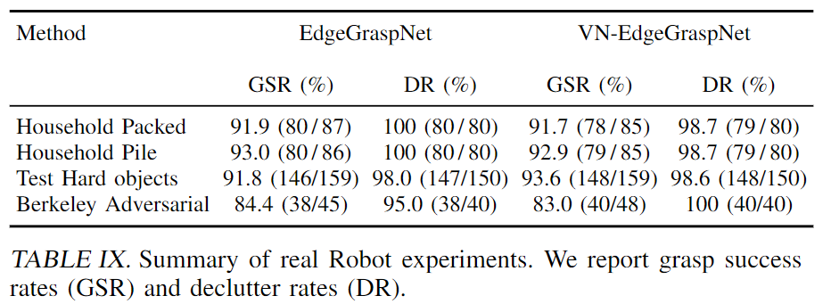

<head>
<script type="text/javascript" src="https://cdn.mathjax.org/mathjax/latest/MathJax.js?config=TeX-AMS-MML_HTMLorMML">
</script>
<script type="text/x-mathjax-config">
MathJax.Hub.Config({ tex2jax: {inlineMath: [['$','$'], ['\\(','\\)']], processEscapes: true}, "HTML-CSS": {minScaleAdjust: 100} });
</script>
</head>

**Abstract:**
Given point cloud input, the problem of 6-DoF grasp pose detection is to identify a set of hand poses in $\mathrm{SE}(3)$ from which an object can be successfully grasped. This important problem has many practical applications. Here we propose a novel method and neural network model that enables better grasp success rates relative to what is available in the literature. The method takes standard point cloud data as input and works well with single-view point clouds observed from arbitrary viewing directions.

<style>

.column {
  float: left;
  width: 33.33%;
}
.lc{
  float: left;
  width: 16.66%;
}
.caption {
    margin: 0;
    vertical-align: baseline;
    text-align: center;
}
.column_quarter {
  float: left;
  width: 25.00%;
}
.column_l {
  float: left;
  width: 50.00%;
}
.row::after {
  content: "";
  clear: both;
  display: table;
}

img.rounded {
  object-fit: cover;
  border-radius: 50%;
  height: 120px;
  width: 120px;
  margin-left: auto;
  margin-right: auto;
  display: block;
}
.people_column {
  float: left;
  width: 150px;
}

</style>


## Paper &nbsp;&nbsp; &nbsp;&nbsp; [PDF]()&nbsp;&nbsp;•&nbsp;&nbsp; [CODE coming soon]()&nbsp;&nbsp;•&nbsp;&nbsp;**Arxiv Preprint**

<div style="width:100%; display:flex">
  
<div class="people_column">
    
    <p class="caption">
      <a href="https://haojhuang.github.io">Haojie Huang</a>
    </p>
  </div>

  <div class="people_column">
    
    <p class="caption">
      <a href="https://pointw.github.io">Dian Wang</a>
    </p>
  </div>

  <div class="people_column">
    
    <p class="caption">
      <a href="https://zxp-s-works.github.io/">Xupeng Zhu</a>
    </p>
  </div>

  <div class="people_column">
    
    <p class="caption">
      <a href="http://mathserver.neu.edu/robin/">Robin Walters</a>
    </p>
  </div>

  <div class="people_column">
    
    <p class="caption">
      <a href="http://www.ccs.neu.edu/home/rplatt/">Robert Platt</a>
    </p>
  </div>

</div>

&nbsp;&nbsp; &nbsp;&nbsp; &nbsp;&nbsp;&nbsp;&nbsp; &nbsp;&nbsp; &nbsp;&nbsp;&nbsp;&nbsp;  &nbsp;&nbsp;&nbsp;&nbsp;&nbsp;&nbsp;&nbsp;&nbsp; &nbsp;&nbsp; Khoury College of Computer Science, Northeastern University

## Elevator Pitch

In our paper, we first define the edge grasp. Then, describe our representation of edge grasp step by step. After that, we explore and realize the $\mathrm{SE}(3)$ symmetry inside our representation.
The simulated experiment part of our paper is based on the simulator of  [VGN](https://github.com/ethz-asl/vgn), a simulation environment in PyBullet for 3D grasping. Specifically, we test two different scenarios of grasping task, Packed and Pile.
Finally, we implement our method on the real robot and test four different object sets. Check our paper for more details.

### Sampling-based grasp detection

<p align="center">
  
</p>

Most sample-based grasp detection methods have a clear representation of grasp poses. Our 6-DoF edge grasp is defined with an approach point $p_a$ and a contact point $p_c$.
Assuming that we can estimate the object surface normal $n_c$ at point $p_c$, $(p_a, p_c)$ defines a grasp orientation $R$ where the gripper fingers move parallel to the vector $n_c$ and the gripper approaches the object along the vector $a_{ac} = n_c \times (n_c \times (p_a - p_c))$.
The gripper center $C$ is positioned such that $p_a$ is directly between the fingers and $p_c$ is at a desired point of contact on the finger, $C = p_a - \delta a_{ac}$. Here, $\delta = G_d + (p_a-p_c)^T a_{ac}$ denotes the distance between the center of the gripper and $p_a$ and $G_d$ denotes gripper depth.

One key advantage of this sampling method is that we
can easily provide the approximate position of a desired
grasp as an input to the model. If we want to grasp a tool
by its handle, for example, this is easily achieved by only
considering approach positions and contact locations on the
handle.

### Representation and $\mathrm{SE}(3)$ invariance
It is natural to consider using **edge** that connects the approch point and the contact point to represent such grasp. Specically, we use a graph neural network to generate the local feature of the contatc point and the global feature of the approach point
to build our edge feature. Let's define $P$ as the observed point cloud and $\alpha$ as the 6-DoF grasp. The grasp evaluation problem is to find a function $\Phi: (P, \alpha) \mapsto [0,1]$, that denotes the quality of grasp $\alpha$.
Notice that $\Phi$ is invariant to translation and rotation in the sense that $\Phi(g \cdot P, g \cdot \alpha) = \Phi(P,\alpha)$ for an arbitrary $g \in \mathrm{SE}(3)$. In other words, the predicted quality of a grasp attempt should be invariant to transformation of the object to be grasped and the grasp pose by the same rotation and translation.


## Real Robot Experiment
We measure physical grasp performance with 4 different object sets. As shown in the figure below, the first row shows the object sets and the second row showns the configurations. From the left column
to the right column, there are packed scenarios from 10 objects, pile scenarios from 10 objects, 20 test hard objects, and 12 berkeley adversarial objects. 
We enable rotational invariance with two different approaches. The first approach is to use data augmentation and the second approach is to use an $\mathrm{SO}(3)$-equivariant model, Vector Neurons. As we show in our paper, leveraging $\mathrm{SO}(3)$ symmetries is beneficial to learn a grasp function.
<div>
  <div class="column_quarter">
    
    <p class="caption">10 packed objects</p>
  </div>
  <div class="column_quarter">
    
    <p class="caption">10 pile objects </p>
  </div>
  <div class="column_quarter">
    
    <p class="caption">20 test hard objects</p>
  </div>
  <div class="column_quarter">
    
    <p class="caption">12 Berkeley adversarial objects</p>
  </div>
</div>

<p></p><br>

<p align="center">
  
</p>

The table above shows the grasp success rate (GSR that measures the ratio of successful grasps to total grasps) and declutter rate (DR that measures the ratio of objects removed successfully to the number of total objects presented) of
the real robot experiments.

<div>
  <div class="column_l">
    
    <p class="caption">5 packed objects</p>
  </div>
  <div class="column_l">
    
    <p class="caption">5 pile objects </p>
  </div>
</div>

<div>
  <div class="column_l">
    
    <p class="caption">10 test hard objects</p>
  </div>
  <div class="column_l">
    
    <p class="caption">8 Berkeley adversarial objects</p>
  </div>
</div>

## Citation
```

```

## Contact

huang dot haoj @ northeastern dot edu
